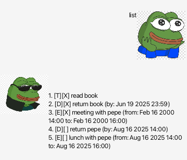
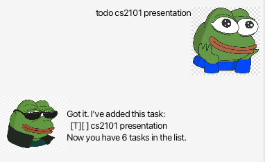
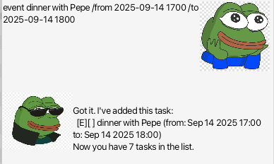
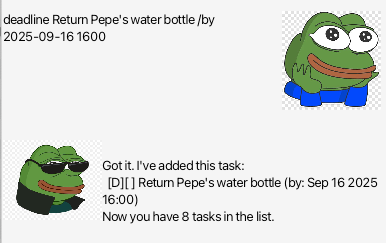
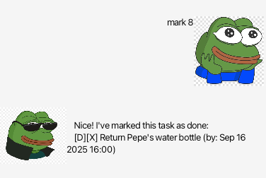
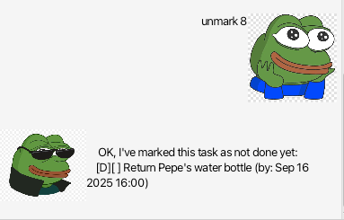
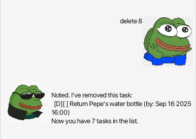
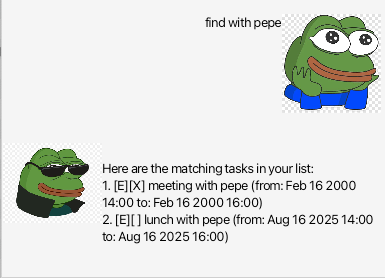
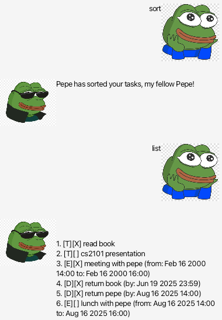

# Pepe

Pepe is a graphical user interface (GUI) desktop app that helps you track your incoming tasks. To start using Pepe, you can:

- Download the `.jar` file under `Releases`
- Navigate to the directory in your terminal
- Run `java -jar Pepe.jar` and Pepe!

## Features

Pepe can provide the following features:

- Adding and deleting tasks
  - Todos
  - Events
  - Deadlines
- Marking and unmarking tasks as done
- Searching tasks with keywords
- Sorting tasks by deadline

## User Guide

- `list`

See a list of your current tasks.

**Usage**

`list`

- `todo`

Create a todo.

**Usage**

`todo <task name>`

- `event`

Create an event.

**Usage**

`event <event name> /from <start time> /to <end time>`

`<start time>` and `<end time>` must be in `yyyy-MM-dd HHmm`.

- `deadline`

Create a deadline.

**Usage**

`deadline <deadline name> /by <time>`

`<time>` must be in `yyyy-MM-dd HHmm`.

- `mark`

Mark a task as done.

**Usage**

`mark <task number>`

Task number is 1-indexed.

- `unmark`

Mark a task as undone.

**Usage**

`unmark <task number>`

Task number is 1-indexed.

- `delete`

Delete a task.

**Usage**

`delete <task number>`

Task number is 1-indexed.

- `find`

Search for tasks based on provided key phrase.

**Usage**

`find <key phrase>`

- `sort`

Sort tasks based on their deadline.

**Usage**

`sort`

- `bye`

Quit the app. Closes after 1 second.

**Usage**

`bye`

